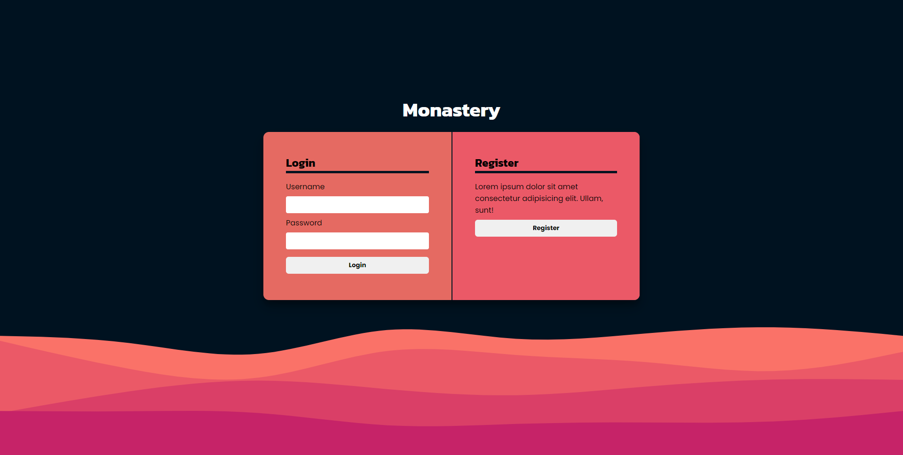

# Lap_2_Project_Monastery

## _Kai, Dave, Ahmed, Oliver, and Peter_

## 

# Monastery Habit Tracking

Monastery Habit Tracking is an habit tracking mobile app, using X. Y, and Z technologies.

## Project Brief

#### Website should have the following functionality for users:

- Users should be able to login
- Users should be able to choose a habit they want to track (e.g water, exercise, 8 hours of sleep) and choose the frequency at which they want to track the habit
- Users should be able to track a habit and mark it as complete for the day
- Users should be able to see if they have completed a habit for the day and see their most recent completion streak

#### Project should meet the following technical requirements:

- Data should persisted in a database
- Minimum 60% test coverage with an aim of 80%
- Your codebase should primarily feature the technologies we have covered so far on the course

## Installation & Usage

### Installation

- Clone or download the repo.
- Open terminal and navigate to `monastery` folder.
- Run `npm install` to install dependencies.

### Usage

- Run `npm start` to launch server.
- Run `npm test` to launch test suite.

## Changelog

### README.md

[x] Fixed filepath to correctly connect `Monastery.png` to `README.md`

### server.js

[x] Updated `prayer` function to accept an argument.

## Bugs

[] Monks refusing to change their habits, despite the smell

## Wins & Challenges

### Wins

- Good Team Members
- Fun app idea

### Challenges

- Not using too many puns

---

### Links

- https://github.com/kaiyuleung/Lap_2_Project_Monastery Repo
- https://gist.github.com/getfutureproof-admin/8ebd3745bda46bd4df6f7b28fdae63fa - Full Brief
- https://www.freecodecamp.org/news/build-a-restful-api-using-node-express-and-mongodb/ - MongoDB Tutorial
- https://github.com/users/kaiyuleung/projects/2 - Kanban
- https://excalidraw.com/#room=9003bca7c4ec65c82a0a,oZYKTmJFnVUI43fh3fe48Q - Excalidraw designs
- https://gist.githubusercontent.com/getfutureproof-admin/dfe45adba508f931bf83d144cbbf6bbe/raw/3731e4d79152089b1607f509c4ae338dfc9c4f82/fp_guides_assignment_README.md - Good README.md guide
